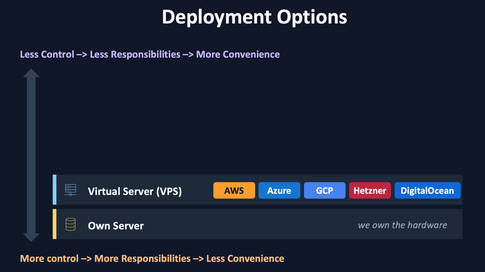

# Launching our first EC2 instance

Our AWS account is set up and secured, so we can finally start using our first AWS service. It is
the service that lets us rent a virtual machine, in other words a **virtual private server (VPS)**.

## Why a VPS?

On the ladder of deployment options, a VPS sits one level above owning your own hardware. Compared
to buying and running a machine yourself, a VPS gives you:

- No big upfront investment, you pay for what you use
- Flexible scaling, up and down
- No hardware to maintain

You give up some control over the environment, but you also give up a lot of responsibility, which
makes a VPS much more convenient for our project.

## What is EC2?

The AWS service for renting virtual servers is **EC2**, which stands for **Elastic Compute Cloud**.
It is one of the most popular AWS services.

Why EC2 and not ECC? Amazon likes this naming pattern. Another example is **S3**, short for Simple
Storage Service. It is catchier than the full name, easier to remember, and better for branding.

EC2 is an example of **Infrastructure as a Service (IaaS)**: AWS provides the machine, and what
happens inside that machine is largely your responsibility.

## Start the setup

1. In the AWS Management Console, search for "EC2" and open the service
2. Make sure the correct **region** is selected in the top right corner
3. Click the orange "Launch instance" button
4. Skip the walkthrough if the console offers one

## Name and tags

The first thing the launch form asks for is a name.

1. Enter `ai-job-workflow` as the name
2. No additional tags are needed

The name is stored as a tag called `Name`. Tags are simple key value pairs that you can attach to
almost any AWS resource, which helps you find, group, and filter your resources later.

We continue with the next steps of the launch form in the next guide.
